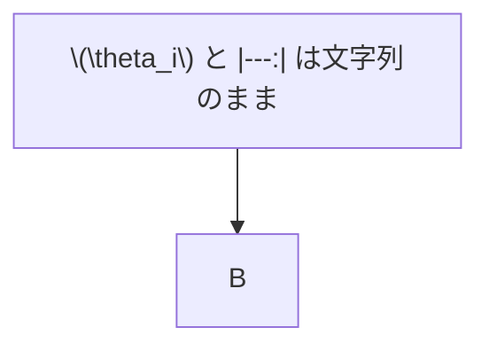

# 数式・表・コード混在資料

インライン数式は \(\theta_i-d_i>0\) である。

\[
A\in\mathbb{R}^{r\times d},\qquad
B\in\mathbb{R}^{d\times r}
\]

| 項目 | 値 | 判定 |
|---|---:|:---:|
| 固有値 | \(\theta_i\) | 合格 |
| 残差 | \(d_i\) | 合格 |

`inline code \(\theta_i\)` は変換しない。

