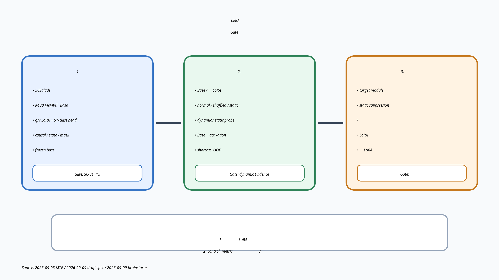

# 2026-09-09 MTG資料: 逐次LoRA基盤の実装承認と後続評価設計

## 0. 今日のMTGで先生に相談したいこと

1. **実装開始の判断**
   - blocking事項が解消した現行draft specを、基盤実装の契約として承認してよいか。
   - 承認後も、まずはunit test・tiny fixture・model smokeまでとし、50Salads全体の学習runは別途判断する。
2. **Base modelの位置づけ**
   - K400 pretrained MeMViTを「基盤を成立させるengineering baseline」として先に使ってよいか。
   - 「画像事前学習モデルへ動画から何が追加されたか」という研究仮説を検証する段階では、画像事前学習Baseとの比較を必須にするか。
3. **後続評価の決め方**
   - 実装と短時間検証は先に進めつつ、full training前にdynamic/static情報の操作的定義、primary metric、control条件を別specで固定する進め方でよいか。

## 1. 現時点の結論・提案

- **基盤実装の仕様は着手可能な粒度まで具体化され、blockingな未決事項は0件になっている。**
- 一方、現時点で成立しているのは「時間情報を検証できる基盤の設計」であり、**LoRAが時間・動作情報を獲得したという科学的Evidenceはまだない。**
- したがって、次の二段階を明確に分けて進めたい。
  1. 現行specを承認し、短時間testで逐次LoRA基盤を成立させる。
  2. full training前に、情報内容を判別する評価設計を別specとして確定する。
- 提案する進め方は、下記「方針B: 基盤実装と最小評価設計を並行して固める」である。

## 2. 前回MTGからの流れ

### 2026-09-03に決まったこと

- 第一目標は、再利用可能なシーケンシャルデータローダとLoRA逐次fine-tuningを動かすこと。
- 基盤成立後に、学習済みLoRAが動画由来情報を保持するかを評価すること。
- 静的・動的情報の分離、直交化、LoRA空間変換は、その後に検討すること。
- 卒論の研究ストーリーを示す模式図を用意すること。

### 2026-09-09までに具体化したこと

- 50Salads、K400 pretrained MeMViT、全16 blockのattention `q` / `v` LoRA、新規51-class frame-level headを使う基盤specを作成した。
- strict causal処理、chunk間state、annotation alignment、Manual Optimization、reset、checkpoint/resume、再現性記録を仕様化した。
- 実装成功条件をSC-01〜SC-15として観測可能な形にした。
- PEFT version、checkpoint SHA-256、resize policy、数値precisionが確定し、Ambiguity Gateのblocking項目は解消した。
- LoRAに保持される情報を調べる後続案として、normal / shuffled / static-repeat比較、dynamic/static probe、Baseとの差分activationを整理した。

## 3. 研究ストーリー

**この図で見る点:** 基盤の成立、科学的評価、改善手法の導入を混ぜず、各段階の判断条件を分ける。

## 4. Evidence: 現在確認できていること

| Evidence | 確認できている内容 | 限界 |
|---|---|---|
| 前回MTGの決定 | 基盤構築 → 情報評価 → 分離・改善の順で進める | 評価方法は未決定 |
| 現行draft spec | dataset、model、LoRA、causality、optimization、再現性、成功条件を固定 | statusは`draft`で、実装権限はまだない |
| ユーザー確認済みの技術検証 A〜O | frame-label対応、checkpoint互換、LoRA更新範囲、loader連携、causality、stateful chunk一致、reset、split整合性を確認済みと報告 | 今回の資料作成時には再実行していない |
| Ambiguity Gate | PEFT 0.20.0、checkpoint SHA-256、bilinear + antialias、`32-true`を確定し、blocking 0件 | helper名などの局所実装は実装時に決める |
| Workspaceの記録 | project配下にexperiment記録・結果図はまだない | 学習性能や科学的仮説は未評価 |
| brainstormでの反例整理 | accuracy向上だけでは、背景・物体・姿勢などのstatic shortcutを除外できない | controlとmetricはまだ候補段階 |

## 5. Interpretation: 現時点の見立て

### 5.1 実装準備について

specは実装scope、非対象範囲、互換性、短時間の成功条件まで記述されている。技術的なblockingはなく、残る判断は「この仕様を研究基盤として採用するか」という承認である。

### 5.2 科学的主張について

K400 pretrained MeMViTは、動画を用いた事前学習ですでに時間・動作情報を持つ可能性がある。そのため、このBaseへLoRAを追加してaction recognitionが改善しても、「画像知識に動画知識が追加された」と直接は主張できない。

当面のK400モデルは、既存checkpointとMeMViT実装を使って逐次LoRA学習を成立させるためのengineering baselineとしては妥当である。一方、最終的な研究仮説には、Baseが元から持つ情報とLoRAが追加した情報を切り分ける比較設計が必要になる。

### 5.3 評価順序について

通常LoRAに何が保持されるかを測る前にmotion-focusedな制約を加えると、改善対象と比較基準が曖昧になる。まず通常LoRAを成立させ、static/dynamic情報の混入を測り、そのEvidenceに基づいてtarget制限、static suppression、直交化などを導入する順序が解釈しやすい。

## 6. 今回言えること / まだ言えないこと

### 今回言えること

- 逐次LoRA fine-tuning基盤の実装条件と短時間の検証条件は具体化されている。
- strict frame-level causalityには、attentionだけでなくPatchEmbedの因果化とchunk間historyが必要である。
- Base parameterをfreezeしても、LoRAが学ぶ内容は時間情報だけには限定されない。
- 基盤の成功条件と、時間・動作情報に関する科学的成功条件は別specに分ける必要がある。

### まだ言えないこと

- LoRAが時間順序、motion、状態遷移、durationのどれを保持するか。
- LoRAに保持される情報がstatic cueよりdynamic cueを優先しているか。
- action recognitionの性能向上がLoRAの時間情報獲得によるものか。
- normal / shuffled / static-repeatのどれが妥当なprimary controlか。
- K400 Baseだけで最終的な研究仮説を検証できるか。

## 7. 方針候補・比較

| 方針 | 内容 | 長所 | リスク |
|---|---|---|---|
| A. 基盤だけ先に実装 | 現行specを承認し、評価設計は実装後に考える | 最短で動作基盤を得られる | full run時に比較条件が足りず、結果を解釈できない恐れ |
| **B. 基盤実装 + 最小評価設計** | 短時間testは開始し、full run前に評価の別specを確定 | 実装を止めず、科学的解釈も守れる | 評価設計を並行して詰める必要がある |
| C. 評価全体を先に確定 | Base比較、probe、control、VLM/生成まで先に設計 | 全体像は明確になる | 基盤未成立の段階では前提が変わりやすく、着手が遅れる |

**提案:** 方針Bを採用する。現行specの実装・短時間testと、後続評価specの論点整理を分けて進め、50Salads全体の学習runを評価spec承認後のGateにする。

## 8. Ask: MTGで決めたいこと

- [ ] 現行draft specを基盤実装用に承認してよいか。
- [ ] 承認後の直近scopeを、unit test・tiny fixture・checkpoint/model smokeまでに限定してよいか。
- [ ] K400 pretrained MeMViTをengineering baselineと位置づけ、画像事前学習Baseとの比較要否は後続評価specで決めてよいか。
- [ ] full training前に、少なくとも以下を別specで固定する方針でよいか。
  - dynamic/static情報の操作的定義
  - primary metric
  - normal / shuffled / static-repeatのcontrol設計
  - Base、LoRA、headのどこに情報が保持されたかを切り分ける方法
- [ ] 後続評価の第一候補を「同一frame集合を用いたnormal vs shuffled比較」とし、OOD交絡を補助controlで検証する方向を深掘りしてよいか。

## 9. MTG後に進む候補

### 基盤specが承認された場合

1. specのstatus変更は、MTG後にユーザー承認を反映して別途行う。
2. SC-01〜SC-12、SC-14、SC-15に対応する実装と短時間testを行う。
3. trainable parameter、frozen Base不変、causality、chunk境界一致、state resetを優先して確認する。
4. 実dataset全体のone-pass training（SC-13）は実行せず、別途許可を待つ。

### 後続評価方針が了承された場合

1. dynamic/static知識の操作的定義を決める。
2. primary metricとcontrol条件を比較する。
3. K400 Baseと画像事前学習Baseの役割を整理する。
4. 通常LoRAの情報内容を測る評価specを作成する。
5. 通常LoRAのEvidenceを見てから、motion-focused化の必要性を判断する。

## 10. 口頭説明用の短いまとめ

> 前回決めた「逐次データローダとLoRA基盤を先に作る」方針を、50SaladsとMeMViTで実装可能なspecまで具体化しました。技術的なblockingは解消しています。ただし、K400 pretrained Baseを使うため、この基盤の性能だけで「画像モデルに動画知識が追加された」とは言えません。そこで、基盤の短時間testは進めつつ、full training前にnormal/shuffled等のcontrol、primary metric、Base比較を別specで固めたいです。本日は、基盤specの承認と、この二段階の進め方を相談したいです。

## 11. 参照ファイル

- [プロジェクトREADME](../README.md)
- [2026-09-03 MTG議事録](../meetings/2026-09-03-mtg.md)
- [50Salads時系列逐次LoRA fine-tuning基盤 draft spec](../specs/2026-09-09-sequential-lora-finetuning-spec.md)
- [動画逐次学習LoRAの情報解析 brainstorm](../../../../secretary/notes/brainstorm/2026-09-09-video-lora-temporal-knowledge-analysis.md)
- [Figure manifest](figures/2026-09-09-sequential-lora-baseline-and-evaluation/manifest.md)

