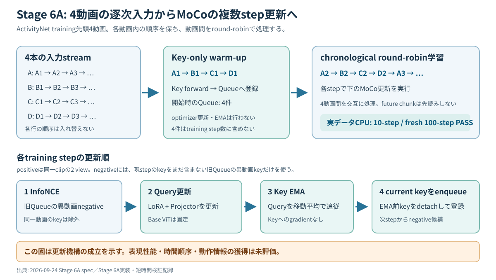

# 次回MTG資料: MoCo実装進捗とActivityNet multi-step結果・次の評価方針

作成: 2026-09-24／MTG予定日: 未指定

## 0. 今日のMTGで先生に相談したいこと

1. **次に何を研究上の評価対象とするか。** 実ActivityNetで100回の自己教師あり更新まで動いた。次は、学習前後の表現変化を測る評価と、時間順序への感度を測る評価のどちらを先に設計・実施するか。
2. **「時系列順 vs shuffle」の操作単位と評価指標をどう定めるか。** 現行のmasked meanは1 clip内のframe順を使わない。動画内chunkの更新順、動画間の提示順、clip内frame順を区別したうえで、最初に比較する条件を決めたい。
3. **4-stream round-robinを当面の基準とするか。** これは各動画内の時系列を保つが、1動画ずつ処理する厳密なonline条件とは異なる。今後の比較でどちらを研究対象にするか確認したい。

## 1. 現時点の結論

前回MTGで優先した「1方式を選び、動画LoRAの学習・観測・比較へ進める経路」のうち、**学習更新を実動画で連続実行する経路は成立した**。画像事前学習済みViT、Q/V LoRA、MoCo v2型のQueueとmomentum encoderを接続し、ActivityNetの4動画でCPUの10-stepとfresh 100-stepを完了した。全stepで有限な値と異動画negativeを確認し、frozen Base ViTは変化しなかった。

これは**更新機構の成立と100-step範囲の安定性**を示す。表現性能の向上、時間順序・動きの獲得、時系列順の優位性は、まだ測っていない。前回MTGの目標と決定事項は[9月17日の議事録](../meetings/2026-09-17-mtg.md)、今回の実測値は[Stage 6A検証記録](../experiments/2026-09-24-stage6a-moco-multistep-verification.md)に基づく。

## 2. 前回MTGからの進捗

| 段階 | 今回確認できたこと | 研究上の位置付け |
|---|---|---|
| 9/23: データと特徴抽出 | 50Saladsの逐次loaderからfrozen ViTのframe特徴列を取得。ActivityNet Adapterでtraining 10,024動画を認識し、ActivityNet 1 chunkからmasked meanによるclip特徴 `[768]` を生成。 | 実動画をViTに通す入力経路と、順序不変の基準表現が成立。 |
| 9/24: Stage 4 | ActivityNetの16 frameでViT Q/V LoRAを1 step更新。学習対象294,912 parameters、Base変更0、LoRA変更24 tensors。 | LoRAへの勾配・更新経路を確認。lossは経路確認用。 |
| 9/24: Stage 5 | 2動画の実データでMoCo 1 step。Query LoRA・Projector更新、KeyのEMA、異動画negativeを確認。 | 対照学習の各要素を接続。 |
| 9/24: Stage 6A | 4動画のchronological round-robinで実ActivityNet 10-step、別fresh processの100-stepが成功。新規42件と既存125件のテストも成功。 | 複数stepにわたる更新契約を検証。 |

この表は実験の実施順を示す。詳細は[ActivityNet Adapter](../experiments/2026-09-23-activitynet-adapter-verification.md)、[Stage 3](../experiments/2026-09-23-activitynet-clip-feature-verification.md)、[Stage 4](../experiments/2026-09-24-vit-lora-one-step-verification.md)、[Stage 5](../experiments/2026-09-24-stage5-moco-one-step-verification.md)、[Stage 6A](../experiments/2026-09-24-stage6a-moco-multistep-verification.md)の検証記録を参照。

## 3. Stage 6Aの実験条件

この図で見る点: **4本の動画はそれぞれ時系列順に進み、最初のchunkだけでQueueを準備した後、各動画の次chunkを順番に更新する。**

- データ: ActivityNet v1.3の`training` splitからAdapter順の先頭4動画を固定。各動画を独立streamとし、1 chunkは連続16 frame。annotationのlabelやsegmentを学習入力に使わない。
- 表現: `google/vit-base-patch16-224`のframe特徴をvalid frameだけmasked meanで集約。Base ViTを固定し、各attention層のQ/V計24箇所にrank 8のLoRAを付ける。
- MoCo: 同じclipのraw viewと左右反転viewをpositiveにし、過去Queue中の**異なるsequence_id**だけをnegativeに使う。Queue容量4096、momentum 0.999、temperature 0.07。Query LoRAとProjectorをAdamWで更新し、Key LoRAとProjectorはEMAで追従する。
- 順序: `A1/B1/C1/D1`をKey-onlyでwarm-upしQueueを4件にする。学習は`A2/B2/C2/D2/A3...`。各動画内のchunk順を維持し、未来chunkを先読みしない。10-stepと100-stepはモデル・optimizer・Queueを共有しない独立run。
- 実行: 実動画decodeを伴うCPU・offlineの短時間検証。GPU学習とActivityNet全体の学習は含まない。

実装条件は[Stage 6A spec](../specs/2026-09-24-stage6a-moco-multistep-canary-spec.md)に固定されている。

## 4. Evidence: 実験結果の詳しいレビュー

| 確認項目 | 実ActivityNet 10-step | 実ActivityNet fresh 100-step | 読み方 |
|---|---:|---:|---|
| 完了した学習更新数 | 10 | 100 | どちらも指定stepへ到達し`PASS`。 |
| Queue件数 | warm-up後4 → 終了時14 | warm-up後4 → 終了時104 | 1 stepに1 keyを追加。容量4096には達していない。 |
| 各stepの有効negative | 3件以上 | 3件以上 | 同一動画を除いたnegativeでlossを計算できた。 |
| Query Baseの変更tensor数 | 0 | 0 | Base凍結を維持。 |
| Query LoRA／Projectorの変更tensor数 | 48／4 | 48／4 | 学習対象が開始時から変化。性能向上の指標ではない。 |
| Key Baseの変更tensor数 | 0 | 0 | Key Baseも凍結を維持。 |
| Key LoRA／Projectorの変更tensor数 | 48／4 | 48／4 | EMA対象の状態が変化。tensor差分だけで効果は判断しない。 |

両runで全stepのQuery LoRA／Projector勾配は有限かつ非ゼロ、Query BaseとKeyのbackward勾配は0。parameterとQueue keyも全stepで有限だった。更新順序は**更新前Queueでloss → Query optimizer → Key EMA → 計算済みpositive keyのenqueue**を監査した。新規42件・既存125件のテストが成功し、人工データの10/100-stepテストではEOF・異常値・更新順序・Reader解放なども検証した。100-stepは10-stepと別processのfresh stateで実行した。[Stage 6A検証記録](../experiments/2026-09-24-stage6a-moco-multistep-verification.md)

lossやpositive similarityはstep間で変動したが、単調減少を成功条件にはしていない。Stage 5の1-stepでもlossは有限で更新は起きたが、その値を学習成果とは解釈しない。[Stage 5検証記録](../experiments/2026-09-24-stage5-moco-one-step-verification.md)

## 5. Interpretation: 何が分かり、何が残るか

**今回言えること**

- 実ActivityNetの4動画を各動画内で時系列順に読み、同一のMoCo更新規則を100 step継続できた。
- frozen Baseを保持しながらQuery LoRA／Projectorへ勾配を流し、KeyをEMAで追従させる経路が動いた。
- 4-streamの範囲では、同一動画をnegativeから除いても各stepに異動画negativeが残った。

**まだ言えないこと**

- 学習後の表現が学習前より有用になったか。下流指標、linear probe、特徴比較などは未実施。
- LoRAが時間順序や動きを獲得したか。masked meanは同じframe集合の並べ替えに不変であり、時系列順に更新した事実だけでは時間表現を示せない。
- 逐次順序がshuffleより良いか。同一データ・更新回数で順序だけを変える比較は未実施。
- 長時間・大規模学習、GPU実行、Queueの入れ替わり、厳密な1動画ずつのonline条件で同じ性質が保たれるか。今回のQueue最大件数は104で、容量4096より小さい。

以上は[Stage 6A検証記録](../experiments/2026-09-24-stage6a-moco-multistep-verification.md)と、順序不変性を確認した[Stage 3検証記録](../experiments/2026-09-23-activitynet-clip-feature-verification.md)からの解釈。4-streamが厳密なonline条件ではない点は[Stage 6A壁打ち記録](../../../../secretary/notes/brainstorm/2026-09-24-stage6a-moco-multistep-canary.md)にも明記されている。

## 6. 次の評価方針の候補

| 候補 | 最初に答えられる問い | 準備・注意点 |
|---|---|---|
| A. 現行MoCoの表現を評価 | 100-stepを超えて学習したLoRAは、frozen ViTと比べて測定可能な表現変化・有用性を示すか。 | 学習前後の**pre-projector**特徴を主対象にし、評価データ・指標・更新回数を先に固定する。現在の4動画・決定的viewだけで一般化を主張しない。 |
| B. 更新順序を比較 | 同一動画・同一chunk集合でも、chronological更新とchunk順のshuffleで結果が変わるか。 | shuffleの単位を固定し、初期モデル・乱数、更新回数、動画構成、Queue規則を揃える。順序で変わるQueue内訳は記録し、shuffle側の未来chunk利用はonline条件と区別する。 |
| C. 時間表現に踏み込む | frameの順序や動きに反応する表現をLoRAに学習させられるか。 | 現行masked meanのまま単純なframe reverseだけを比較しても出力は変わらない。順序を使う集約または時間依存の目的と、reverse／static-repeatなどのcontrolを別途設計する。 |

**相談用の暫定案:** まずAの評価指標とBのshuffle単位を決め、現行方式で測れる範囲を確かめる。その結果を見てCを設計する。時間情報の獲得を最優先するならCを先に設計する選択もある。いずれも今回のMTGで研究上の優先順位を確認したい。

## 7. Ask: MTG後に決めたいこと

1. 次の主結果を、**表現の有用性**、**更新順序の効果**、**時間順序への感度**のどれに置くか。
2. 最小controlは何か。特に「shuffle」は動画内chunk順、動画間順、clip内frame順のどれを指すか。現行の順序不変表現で答えられる範囲も確認する。
3. 最初の比較に使うデータ分割・指標・更新回数・seed数をどの程度にするか。4-streamを継続するか、厳密なonline条件へ移るか。

## 8. 参照ファイル・記録上の注意

- [前回MTG議事録](../meetings/2026-09-17-mtg.md)
- [プロジェクトREADME](../README.md)
- [Stage 6A実装spec](../specs/2026-09-24-stage6a-moco-multistep-canary-spec.md)
- [Stage 6A実験・検証記録](../experiments/2026-09-24-stage6a-moco-multistep-verification.md)
- [Stage 5実験・検証記録](../experiments/2026-09-24-stage5-moco-one-step-verification.md)
- [Stage 4実験・検証記録](../experiments/2026-09-24-vit-lora-one-step-verification.md)
- [Stage 3実験・検証記録](../experiments/2026-09-23-activitynet-clip-feature-verification.md)
- [Stage 6A壁打ち記録](../../../../secretary/notes/brainstorm/2026-09-24-stage6a-moco-multistep-canary.md)

READMEのsummary・現在の状況には「実ActivityNet 10/100-stepは実行指示待ち」「未コミット」という古い記述が残っている。本資料の実行完了とcommitの記述は、その後に更新されたStage 6Aのspec・実験記録に基づく。
