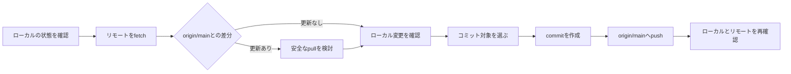

# Gitリポジトリを安全に同期し、変更をコミット・pushするまで

> この資料で分かること: Gitのリモート確認から、不要なファイルを除外したコミットとpushまでの流れを、今回の実例に沿って整理する。Gitを始めたばかりの人が「何を確認し、どの変更を保存し、最後に何を確認するか」を追えることを目的とする。

## 1. 今回の問い

今回の中心的な問いは、次の2つだった。

1. ローカルのGitリポジトリを、リモートリポジトリの最新状態と一致させるにはどうするか。
2. ローカルにある変更を、意図しないファイルを混ぜずにコミットしてリモートへ送るにはどうするか。

ここでいう「リモート」は、GitHubなどネットワーク上にあるリポジトリを指す。今回の対象リモートは `origin` である。

## 2. 背景と前提

最初の確認時点では、ローカルの `main` ブランチは `origin/main` を追跡していた。また、ローカルには次の状態があった。

- `origin/main` とローカル `main` は同じコミットで、取り込む更新はなかった。
- 研究プロジェクトのREADMEと日次TODOに、コミット対象になりうる変更があった。
- `.DS_Store` と `__MACOSX/` は、macOSや圧縮展開時に作られるメタデータで、今回の研究内容ではなかった。

`git pull --ff-only` は、履歴を自動的に分岐・統合するマージを行わず、単純に先へ進められる場合だけ更新する方法である。今回のように既存変更を慎重に扱いたい場面で、確認しやすい。

## 3. 用語の整理

| 用語 | 簡単な意味 | 今回の議論での役割 |
| --- | --- | --- |
| ローカルリポジトリ | 手元のPCにあるGit管理対象 | 変更の確認・コミットを行った場所 |
| リモートリポジトリ | GitHubなどにある共有先 | `origin` としてpush先になった |
| ブランチ | 変更履歴を分けて管理する線 | `main` を使用した |
| `fetch` | リモートの最新情報を取得する操作 | `origin` と `upstream` の状態確認に使用した |
| `pull` | リモート情報の取得と、可能ならローカルへの反映を行う操作 | `origin/main` が最新か確認した |
| stage | 次のコミットに含める変更を選ぶ場所 | 2つのMarkdownだけを選択した |
| commit | 変更を履歴として保存する単位 | `ec2df00` を作成した |
| push | ローカルのコミットをリモートへ送る操作 | `origin/main` へ反映した |

## 4. 壁打ちで確認したこと

### 4.1 リモートの状態

| 主張 | 出所 | 状態 | 根拠・理由 |
| --- | --- | --- | --- |
| `origin/main` はローカル `main` と同じ状態だった | AIによる確認 | 確認済み事実 | fetch後の差分確認で、両者の差分が0件だった |
| `upstream/main` は今回のpush先ではなかった | AIによる確認 | 確認済み事実 | 現在のブランチは `origin/main` を追跡していた |
| `git pull --ff-only origin main` を実行した | AIによる実施 | 確認済み事実 | 結果は `Already up to date.` だった |

### 4.2 コミット対象の選別

| 変更 | 扱い | 理由 |
| --- | --- | --- |
| プロジェクトREADME | コミットした | 実装フォルダの場所とプロジェクト文脈を追記した研究記録だった |
| 日次TODO | コミットした | 研究作業のTODOを追記した記録だった |
| `.agents/.DS_Store` | コミットしなかった | OS由来のメタデータで、研究内容ではない |
| `.agents/skills/.DS_Store` | コミットしなかった | OS由来のメタデータで、研究内容ではない |
| `__MACOSX/` | コミットしなかった | 圧縮ファイル展開時のメタデータで、研究内容ではない |

ここで重要なのは、作業フォルダに存在するファイルをすべて自動的にコミットするのではなく、今回の目的に必要なファイルだけをstageした点である。

## 5. 採用済みの決定

ユーザーから「コミットプッシュしてください」と明示されたため、確認済みの2つのMarkdown変更をコミットし、`origin/main` へpushした。

| 項目 | 内容 |
| --- | --- |
| 出所 | ユーザー発言 |
| 状態 | 採用済み決定 |
| コミット | `ec2df00 docs: update research workspace context` |
| push先 | `origin/main` |
| 結果 | ローカル `main` と `origin/main` が同期 |

## 6. 図解: 安全にpushする流れ

次の図は、今回実際に行った操作の順序を示す概念図である。ポイントは、pushの前に「リモートとの差分」と「コミット対象」を確認することである。

この流れでは、`fetch` は「リモートの情報を調べる」、`pull` は「その情報をローカルへ反映する」、`push` は「ローカルのコミットをリモートへ送る」という役割分担になっている。

## 7. 実施前後の状態

| タイミング | ローカルの状態 | リモートの状態 | 判断 |
| --- | --- | --- | --- |
| 確認前 | 2つのMarkdown変更と未追跡メタデータあり | `origin/main` と同じ履歴 | 先に内容を確認する |
| commit後 | `ec2df00` が追加された | まだpush前 | push対象を確認する |
| push後 | `main` が `ec2df00` | `origin/main` も `ec2df00` | 同期済み |

## 8. 未採用案・暫定見解

- `.DS_Store` や `__MACOSX/` を削除することは、今回の依頼には含めなかった。AI提案としてコミット対象から除外したが、ローカルには未追跡ファイルとして残っている。状態は **要確認** である。
- `.gitignore` にこれらを追加することも、今回の依頼には含めなかった。再発防止が必要かどうかは、別途判断する。

## 9. 要確認・未解決点

現時点でpush自体は完了している。一方、次の点は未処理である。

1. `.DS_Store` と `__MACOSX/` を今後も残すのか、削除または `.gitignore` で無視するのか。
2. `origin` と `upstream` の役割を今後どう使い分けるのか。今回のpush先は `origin` だった。

## 10. 次のアクション

| アクション | 目的 | 担当 | 期限・タイミング |
| --- | --- | --- | --- |
| 未追跡のメタデータを整理するか判断する | 作業ツリーを不要なファイルのない状態にする | 要確認 | 次回Git操作の前 |
| 必要なら `.gitignore` を整備する | 同じメタデータが今後表示されないようにする | 要確認 | 方針決定後 |

## 11. まとめ

今回の作業では、リモートの最新状態を確認したうえで、研究記録に関係する2つのMarkdownだけを選び、コミット `ec2df00` として `origin/main` へpushした。最終的にローカルとリモートは同期している。

ただし、同期済みであることと、作業フォルダが完全に整理済みであることは別である。`.DS_Store` と `__MACOSX/` はpush対象から除外されたが、ローカルには未追跡のまま残っている。
